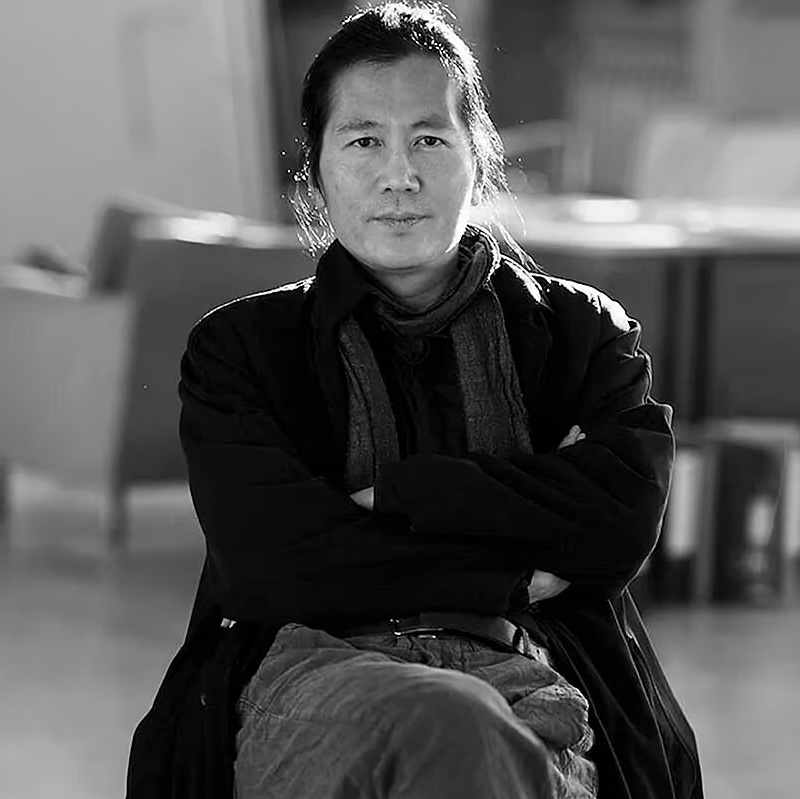

# Byung-Chul Han - Portafolio Digital

Este proyecto es un portafolio digital diseñado para destacar la carrera y las contribuciones de Byung-Chul Han, filósofo y teórico de la cultura. Puedes explorar el portafolio completo haciendo clic [aquí](https://portafolio-1-rust.vercel.app).

## Tecnologías utilizadas

Este portafolio ha sido construido con un enfoque en las mejores prácticas de desarrollo web moderno, utilizando las siguientes tecnologías y metodologías:

- **HTML**: Para la estructura y el contenido semántico.
- **CSS**: Para el diseño visual, utilizando técnicas avanzadas de estilización.
- **JavaScript**: Para la interactividad y funcionalidad dinámica.
- **Git**: Para el control de versiones y la colaboración en el desarrollo.
- **Vite**: Como herramienta de desarrollo y empaquetado, optimizando la carga y el rendimiento.
- **Modern Normalize**: Para asegurar la consistencia de estilos entre navegadores.
- **Mobile First**: Metodología de diseño que prioriza la experiencia en dispositivos móviles.
- **Metodología BEM**: Para la organización y el mantenimiento eficiente del CSS.
- **Carga diferida**: Implementación de Lazy Loading para optimizar el tiempo de carga de las imágenes.

## Características Adicionales

- **Modo Claro y Oscuro**: El portafolio incluye la opción de alternar entre modos claro y oscuro, mejorando la accesibilidad y la experiencia del usuario en diferentes condiciones de iluminación.

Este proyecto representa un ejemplo sólido de cómo se puede combinar la tecnología con el diseño para crear una presentación profesional y efectiva.
